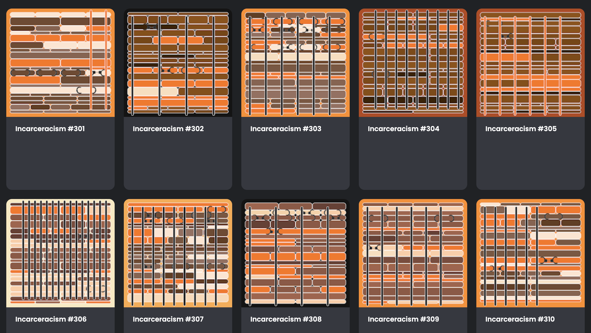

# Incarceracism
Incarceracism is a data influenced view of the 70% racial minorities incarceration percentage based on the [Prisoners in 2020 - Statistical Tables NCJ 302776](https://bjs.ojp.gov/library/publications/prisoners-2020-statistical-tables) report provided by the Bureau of Justice Statistics.

NFT art details: 
6,763 x 6,763 pixels PNG ERC-721 NFT [CC0 license](https://creativecommons.org/share-your-work/public-domain/cc0/)

## Description
In my life I have learned that words may not be as impactful as data. In this situation I don't feel I have many more words I could add to frame the thoughts and discussions that this data should call forth and draw out. I can provide a vehicle for the data to be looked at in another way. That is what I am hoping the Incarceracism art and NFT lends to facilitate change. The colors of the art are directly influenced in the programming logic that produces them to be at least 70% racially symbolic. The imagery is meant to be straightforward, but I hope someone can appreciate them in a way that one may be displayed and cause someone to pause, think, and act.

There are a total of 3,000 pieces in the series, but will be distributed across multiple chains to spread the idea as far and wide as possible. Most of the series will be free mint except to provide a few examples to demonstrate. On Polygon 1,000 of them will be minted to demonstrate the series and to be held by the creator for yet to be determined future allocation. See below for how they are distributed.

| chain | series     | amount                                          |
|-------|------------|-----------------------------------|
| Ethereum (ETH) | #1 - 100 | 100 - 3 minted, 97 free mint |
| Tezos (XTZ) | #101 - 200 | 100 minted |
| Polygon (MATIC) | #201 - 2,900 | 1000 allocated to creator, 1700 free mint |
| Fantom (FTM) | #2,901 - 3,000 | 100 - 3 minted, 97 free mint |

[Etherscan](https://etherscan.com/address/0x5C3071CA988d75363A9CD800Bef9CBd2CeA005f4) | 
[Polyscan](https://polygonscan.com/address/0x041C3Ffed16970ffbAD868e409d106576CDAE905) | 
[Fantomscan](https://ftmscan.com/address/0x16d2e7daf6636c49dd5dd85a09320d7b457f89c5) | 
[Twitter](https://twitter.com/mindrash) | 
[Discord](https://discord.gg/B8F2R3qd) | 
[metadevil.io](https://metadevil.io) | 
[pebkac.fyi](https://pebkac.fyi) | 
[itsmookie.com](https://itsmookie.com)

## Examples

## Technologies
- Python - art generation
- Solidity - ERC-721
- Ethereum, Tezos, Polygon, Fantom
- IPFS - hashed image on meta

ETH Contract: 0x5C3071CA988d75363A9CD800Bef9CBd2CeA005f4 
Polygon Contract: 0x041C3Ffed16970ffbAD868e409d106576CDAE905 
Fantom Contract: 0x16d2e7daf6636c49dd5dd85a09320d7b457f89c5 
Tezos Contract: 0x16d2e7daf6636c49dd5dd85a09320d7b457f89c5 

## Variations

| variation           | description                                             |
|---------------------|---------------------------------------------------------|
| bg_color      | 8 colors |
| shapes color  | 70%+ minority colorations between 7 randomly selected palettes including orange  |
| bars          | 5% no bars, 95% random 2 - 23 bars |
| handcuffs     | random 1 - 20 with 1,000 attempts to place or else 0|
| bar color               | 98% black 2% orange |
| rotated                 | 33% rotated 180 degrees |

## Data
## Prisoners in 2020 – Statistical Tables
NCJ Number 302776 
Author(s): E. Ann Carson, Ph.D., BJS Statistician 
Date Published: December 2021 
Publication: Series Prisoners 

### Description

This report is the 95th in a series that began in 1926. It describes demographic and offense characteristics of state and federal prisoners. It also provides data on prisoners held under military jurisdiction. Findings are based on data from BJS’s National Prisoner Statistics program.
  
[https://bjs.ojp.gov/library/publications/prisoners-2020-statistical-tables](https://bjs.ojp.gov/library/publications/prisoners-2020-statistical-tables)
  

---

[Etherscan](https://etherscan.com/address/0x9c285E47c61B625952EF1F492160CefE12D69ffc) | 
[Polyscan](https://polygonscan.com/address/0x501637fa5ea4c19086425de328f45309a973d669) | 
[Fantomscan](https://ftmscan.com/address/0x16d2e7daf6636c49dd5dd85a09320d7b457f89c5) | 
[Twitter](https://twitter.com/mindrash) | 
[Discord](https://discord.gg/B8F2R3qd) | 
[metadevil.io](https://metadevil.io) | 
[pebkac.fyi](https://pebkac.fyi)

